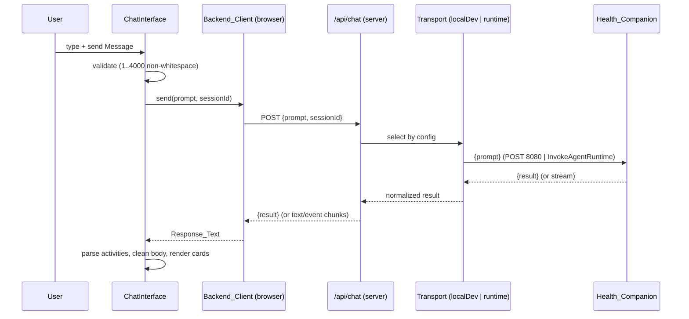

# Design Document

## Overview

This document describes the technical design for the **Health Companion Frontend** — a chat-style web application that lets a user converse with the existing CareBridge UAE agent (an AWS Bedrock AgentCore runtime built with Strands, at `AgentCoreProject/app/HealthAgent/main.py`).

The frontend is a single-page conversational UI built with **shadcn/ui** components on **React**. It renders the conversation, parses the agent's `[ACTIVITY] <EVENT_NAME>` workflow markers into an activity timeline, surfaces provider options and a mock-booking confirmation, gates a consent-controlled care snapshot, and displays a bilingual (English LTR + Arabic RTL) clinician handoff. A persistent "not medical advice" disclaimer is always visible.

The agent is a **navigation** assistant. It never diagnoses, prescribes, or gives treatment advice, and the frontend must not undermine that framing. The frontend also must keep protected health information (PHI) out of any client-side logs or analytics (Requirement 13).

### Backend contract

The backend is invoked with a JSON event `{ "prompt": <string> }` and returns `{ "result": "<assistant text>" }` (see `handler` in `main.py`). The assistant text is free-form markdown that may embed:

- Zero or more workflow markers on their own line: `[ACTIVITY] <EVENT_NAME>`.
- Provider options (routine route), a booking-confirmation prompt, a care-snapshot review card, and a bilingual handoff (English clinician section + Arabic `ملخص الزيارة للمريض ومقدم الرعاية` section).

Known event identifiers: `TRIAGE_GUIDANCE_RETRIEVED`, `RELEVANT_CONTEXT_RETRIEVED`, `MEDICATION_REFERENCE_CHECKED`, `PROVIDER_OPTIONS_FOUND`, `BOOKING_AWAITING_CONFIRMATION`, `MOCK_BOOKING_CONFIRMED`, `VISIT_SUMMARY_GENERATED`, `URGENT_ESCALATION_SHOWN`.

### Two invocation paths

1. **Local dev** — `agentcore dev` serves the agent at `http://0.0.0.0:8080`. The frontend can `POST { "prompt": "..." }` and read `{ "result": "..." }` (Requirement 2.3).
2. **Deployed AgentCore runtime** — invoked via the `InvokeAgentRuntime` data-plane API using a `runtimeSessionId` of at least 33 characters (Requirements 2.4, 3.1). This API requires AWS SigV4 credentials and returns a streaming response.

### Key design decision: a thin backend-for-frontend (BFF) proxy

A browser cannot safely call `InvokeAgentRuntime` directly: doing so would require shipping long-lived AWS credentials to the client, and the endpoint is not CORS-friendly for SigV4. Exposing credentials would also violate Requirement 11.2 (error notices must never contain credentials/tokens/internal endpoint values).

Therefore the deployed path goes through a **server-side route** (a Next.js Route Handler) that holds AWS credentials, calls `InvokeAgentRuntime`, and relays the response to the browser as a normalized `{ "result": "..." }` payload (or a stream of text chunks). The local-dev path can either hit `http://0.0.0.0:8080` directly or route through the same proxy for a uniform client. This makes **Next.js (App Router)** the recommended stack because it gives us the server route and the React client in one deployable unit.

The `Backend_Client` in the browser therefore always talks to a single same-origin endpoint (`/api/chat`), and the *transport* difference (local dev vs runtime) is resolved server-side from configuration (Requirement 2.5). This keeps endpoint values out of the client entirely.

## Architecture

### Stack

- **Next.js (App Router) + React + TypeScript** — provides both the client UI and a server-side proxy route in one project. (Alternative considered: Vite + React SPA; rejected as the primary option because a browser-only SPA cannot hold AWS credentials for the runtime path and would need a separate server anyway.)
- **shadcn/ui + Tailwind CSS** — component layer (Requirement 1.7). Components used: `Card`, `Button`, `Textarea`/`Input`, `ScrollArea`, `Alert`, `Badge`, `Separator`, `Skeleton`, `Sonner` (toasts), `DropdownMenu`/`Select` (language toggle).
- **AWS SDK for JavaScript v3** — `@aws-sdk/client-bedrock-agentcore` on the server route only, for `InvokeAgentRuntime`.
- **Testing**: Vitest + React Testing Library (unit/component), fast-check (property-based tests), Playwright optional for end-to-end.

### High-level structure

```
health-companion-frontend/
├── app/
│   ├── page.tsx                 # Chat page (client shell)
│   ├── layout.tsx               # Root layout; sets dir/lang
│   └── api/chat/route.ts        # BFF proxy: local-dev OR runtime transport
├── components/
│   ├── chat/                    # ChatInterface, MessageList, MessageBubble, Composer
│   ├── activity/                # ActivityTimeline, ActivityEntry
│   ├── cards/                   # ProviderOptions, BookingConfirm, CareSnapshot, ClinicianHandoff
│   ├── layout/                  # Disclaimer, LanguageToggle, AppShell
│   └── ui/                      # shadcn/ui generated components
├── lib/
│   ├── backend-client.ts        # Browser-side Backend_Client (talks to /api/chat)
│   ├── transport/               # Server transports: localDevTransport, runtimeTransport
│   ├── activity-parser.ts       # Extract [ACTIVITY] markers + clean body
│   ├── response-parser.ts       # Detect care snapshot / handoff / provider sections
│   ├── session.ts               # Session_Id generation
│   ├── config.ts                # Server-side endpoint configuration
│   ├── logger.ts                # PHI-safe logger
│   └── i18n.ts                  # language state + RTL/LTR direction
└── __tests__/                   # unit + property tests
```

### Request flow (single-payload)



### Transport selection

`app/api/chat/route.ts` reads server configuration (`lib/config.ts`) to choose a transport:

- `HC_BACKEND_MODE=local` → `localDevTransport` POSTs to `HC_LOCAL_URL` (default `http://127.0.0.1:8080/invocations`).
- `HC_BACKEND_MODE=runtime` → `runtimeTransport` calls `InvokeAgentRuntime` with `HC_RUNTIME_ARN`, `runtimeSessionId`, and region.

Both transports normalize their output to the same shape so the browser client is transport-agnostic (Requirement 2.5). Endpoint values, ARNs, and credentials live only in server environment variables and are never sent to the client (Requirements 11.2, 13).

## Components and Interfaces

### ChatInterface (`components/chat/ChatInterface.tsx`)

The root chat component. Owns conversation state and orchestrates send/receive.

Responsibilities:
- Render `MessageList`, `Composer`, `Disclaimer`, `ActivityTimeline`, `LanguageToggle`, and a new-conversation control.
- Validate input: 1–4000 chars, at least one non-whitespace char (Requirements 1.1, 1.2, 1.5).
- On submit: append user Message, show pending indicator, disable send control (Requirements 1.8, 4.1, 4.2).
- On response: append agent Message with parsed body + activities, remove pending indicator, re-enable send (Requirements 1.3, 4.3).
- On error/timeout: append/annotate an error indication, re-enable send, preserve the user Message, offer retry (Requirements 1.9, 4.6, 11.1–11.4).

### Composer (`components/chat/Composer.tsx`)

shadcn `Textarea` + `Button`. Enforces max length, blocks whitespace-only submissions, keeps focus after a rejected submission and displays the rejection reason inline (Requirement 1.5).

### MessageList / MessageBubble (`components/chat/`)

`MessageList` renders messages chronologically with visual role distinction (Requirement 1.4) inside a shadcn `ScrollArea`, and auto-scrolls the newest message into view within 500 ms (Requirement 1.6). `MessageBubble` renders the cleaned Message body (markers removed, Requirement 6.4) and, when the message carries urgent treatment, applies a distinct persistent visual indicator (Requirement 7.1).

### ActivityTimeline / ActivityEntry (`components/activity/`)

Renders the ordered list of `ActivityEvent`s for the current session (Requirements 6.1, 6.5). Known identifiers map one-to-one to human-readable labels; unknown identifiers render their raw text and are still shown (Requirements 6.2, 6.3). Duplicate events are preserved as separate ordered entries (Requirement 6.5).

### Cards (`components/cards/`)

- **ProviderOptions** — shown when a message carries `PROVIDER_OPTIONS_FOUND` and the body contains parseable options; renders each option. If the event is present but no options parse, shows a "no options available" notice and no booking control (Requirements 8.1, 8.2). Suppressed entirely when the message is urgent (Requirements 7.2, 7.3).
- **BookingConfirm** — shown when a message carries `BOOKING_AWAITING_CONFIRMATION`; a confirm control sends an explicit confirmation Message in the current session (Requirements 8.3, 8.4). On send failure it shows an error, stays actionable, and preserves session state (Requirement 8.5). Suppressed when urgent (Requirements 7.2, 7.3).
- **CareSnapshot** — shown when a message presents a care snapshot; displays the full snapshot and blocks any handoff until approval. Provides approve and decline controls (Requirements 9.1, 9.2). Approve sends approval within 2 s and shows a confirmation; decline sends nothing and shows no handoff (Requirements 9.3, 9.5). Approval transport failure or >10 s timeout re-enables the approve control and shows an error, with no handoff displayed (Requirement 9.4).
- **ClinicianHandoff** — shown when a message carries `VISIT_SUMMARY_GENERATED`; renders English and Arabic sections as separate labeled blocks, the Arabic block with `dir="rtl"` (Requirements 10.1–10.3). If one section is missing, shows the present section plus an "unavailable" notice for the other (Requirement 10.4).

### Disclaimer (`components/layout/Disclaimer.tsx`)

A persistently visible banner (sticky within the viewport, independent of message-list scroll) stating: navigation support only, not medical advice; does not diagnose/name conditions/prescribe/advise medication; uses synthetic data and simulated provider/booking tools (Requirements 5.1–5.4, 5.2 visibility).

### LanguageToggle + i18n (`components/layout/`, `lib/i18n.ts`)

Lets the user choose English or Arabic; applies `dir="rtl"`/`lang="ar"` on Arabic and `dir="ltr"`/`lang="en"` on English at the layout root, defaults to English LTR, and persists the choice for the session (Requirements 12.1–12.5).

### Backend_Client (`lib/backend-client.ts`) — browser

```typescript
interface SendOptions {
  prompt: string;
  sessionId: string;
  signal?: AbortSignal;
  onChunk?: (partial: string) => void; // called for incremental delivery
}

interface SendResult {
  result: string;         // full Response_Text
  streamed: boolean;      // true if delivered incrementally
}

interface BackendClient {
  send(options: SendOptions): Promise<SendResult>;
}
```

- Always POSTs to same-origin `/api/chat` with `{ prompt, sessionId }` (Requirements 2.1, 3.2).
- Aborts via `AbortController` after 30 s and reports a timeout error (Requirements 2.7, 11.1). The pending-state guard in the UI uses a 60 s ceiling for the visual pending indicator per Requirement 4.6; the transport-level abort is 30 s per Requirements 2.7/11.1.
- If the server relays incremental chunks, calls `onChunk` in order and resolves with the concatenation (Requirement 4.4). If a single payload, resolves once (Requirement 4.5).
- If `result` is absent from an upstream response, the server relays the raw body text as `result` so the user never sees an empty message (Requirement 2.6).

### Server transports (`lib/transport/`)

```typescript
interface Transport {
  invoke(input: { prompt: string; sessionId: string; signal?: AbortSignal }):
    Promise<{ result: string; stream?: AsyncIterable<string> }>;
}
```

- `localDevTransport`: `POST` `{ prompt }` to the local dev URL; read `result` from JSON body; if absent, use the raw body text (Requirements 2.2, 2.3, 2.6).
- `runtimeTransport`: call `InvokeAgentRuntime` with the runtime ARN, `runtimeSessionId = sessionId`, and a JSON payload `{ prompt }`; decode the streaming/EventStream response into text; extract `result` if the payload is JSON, else pass the decoded text through (Requirements 2.4, 2.6). Rejects if `sessionId.length < 33`.

## Data Models

```typescript
type Role = "user" | "agent";

type KnownActivityEvent =
  | "TRIAGE_GUIDANCE_RETRIEVED"
  | "RELEVANT_CONTEXT_RETRIEVED"
  | "MEDICATION_REFERENCE_CHECKED"
  | "PROVIDER_OPTIONS_FOUND"
  | "BOOKING_AWAITING_CONFIRMATION"
  | "MOCK_BOOKING_CONFIRMED"
  | "VISIT_SUMMARY_GENERATED"
  | "URGENT_ESCALATION_SHOWN";

interface ActivityEvent {
  id: string;              // raw EVENT_NAME text (may be unknown)
  known: boolean;          // true if id is a KnownActivityEvent
  label: string;           // human-readable label, or raw id when unknown
  order: number;           // arrival order within the session
}

interface ParsedResponse {
  body: string;                 // Response_Text with all [ACTIVITY] markers removed
  events: ActivityEvent[];      // in order of appearance, duplicates preserved
  isUrgent: boolean;            // events includes URGENT_ESCALATION_SHOWN
}

interface Message {
  id: string;
  role: Role;
  text: string;                 // cleaned body for agent; raw input for user
  createdAt: number;
  status: "pending" | "complete" | "error";
  events: ActivityEvent[];      // agent messages only
  isUrgent: boolean;
  retryCount: number;           // for error retry cap (>= 3 allowed)
}

interface ProviderOption {
  raw: string;                  // source text block for this option
  name?: string;
  specialty?: string;
  location?: string;
  availability?: string;
}

interface HandoffSections {
  english?: string;             // clinician handoff block
  arabic?: string;              // Arabic patient/caregiver block (RTL)
}

interface Session {
  id: string;                   // 33..128 URL-safe chars
  createdAt: number;
  messages: Message[];
  events: ActivityEvent[];      // session-level ordered timeline
}

type Language = "en" | "ar";
```

### Session_Id generation (`lib/session.ts`)

Generates a URL-safe identifier of 33–128 characters using only `[A-Za-z0-9_-]` (Requirement 3.1), derived from a cryptographic random source. A new conversation clears messages and timeline and produces a fresh, distinct id (Requirement 3.3). If generation fails, the client does not send and surfaces a "session could not be started" error (Requirement 3.4).

### Activity parsing (`lib/activity-parser.ts`)

Scans `Response_Text` line by line for the pattern `[ACTIVITY] <EVENT_NAME>`, collects each occurrence in order (duplicates preserved), maps known identifiers to labels, and returns `ParsedResponse` with every `[ACTIVITY] ...` marker removed from `body` — including malformed or unknown markers (Requirements 6.1–6.5).

### Response section parsing (`lib/response-parser.ts`)

Detects the presence of a care-snapshot block, a bilingual handoff (splitting into English and Arabic sections around the Arabic header `ملخص الزيارة للمريض ومقدم الرعاية`), and provider-option blocks in the cleaned body. Section detection drives which cards render; card rendering is further gated by the activity events on the message (e.g., handoff only renders with `VISIT_SUMMARY_GENERATED`).

## Correctness Properties

*A property is a characteristic or behavior that should hold true across all valid executions of a system — essentially, a formal statement about what the system should do. Properties serve as the bridge between human-readable specifications and machine-verifiable correctness guarantees.*

We apply property-based testing to this feature's **pure logic**: activity-marker parsing and body cleaning, session-id generation and validation, urgent detection, provider/handoff section parsing, redaction, and state invariants in the conversation reducer. UI presentation and external transport wiring are covered by example and integration tests (see Testing Strategy). Each property below was derived from the prework analysis and consolidated to remove redundancy.

### Property 1: Valid messages append exactly one user Message

*For any* string with at least one non-whitespace character and length between 1 and 4000, submitting it appends exactly one user Message whose text equals the input, growing the conversation length by one.

**Validates: Requirements 1.2**

### Property 2: Invalid messages are rejected without contacting the backend

*For any* string that is entirely whitespace or exceeds 4000 characters, submitting it appends no Message, issues no Backend_Client request, and produces a rejection reason.

**Validates: Requirements 1.5**

### Property 3: Messages render in chronological order

*For any* sequence of Messages, the rendered order equals the order of their `createdAt` values, and user and agent Messages carry distinct role markers.

**Validates: Requirements 1.4**

### Property 4: Outbound request fidelity

*For any* valid Message submitted within an active Session, the outbound request body has `prompt` exactly equal to the Message text and carries the Session's Session_Id.

**Validates: Requirements 2.1, 3.2**

### Property 5: Result extraction round-trip

*For any* string value placed in a backend response `result` field, the extracted Response_Text equals that value; and *for any* non-empty response body that omits `result`, the extracted Response_Text equals the raw body text (never empty).

**Validates: Requirements 2.2, 2.6**

### Property 6: Session_Id generation bounds and charset

*For any* generated Session_Id, its length is between 33 and 128 inclusive and every character is in the URL-safe set `[A-Za-z0-9_-]`.

**Validates: Requirements 3.1**

### Property 7: New conversation clears state and yields a distinct Session_Id

*For any* populated Session, starting a new conversation produces an empty Message list, an empty Activity_Timeline, and a new Session_Id distinct from the previous one.

**Validates: Requirements 3.3**

### Property 8: Single in-flight request per Session

*For any* number of additional submit attempts made while a request is in progress, exactly one Backend_Client request is issued for that turn.

**Validates: Requirements 4.2**

### Property 9: Incremental delivery preserves content and order

*For any* sequence of response chunks delivered incrementally, the displayed agent Message text equals the in-order concatenation of the chunks.

**Validates: Requirements 4.4**

### Property 10: Message preservation and send re-enable on failure

*For any* prior conversation state, a request that fails, returns an error, or times out preserves every previously exchanged Message in the conversation view and leaves the send control enabled.

**Validates: Requirements 1.9, 4.6, 11.1, 11.4**

### Property 11: Activity timeline order and multiplicity

*For any* Response_Text containing a sequence of `[ACTIVITY]` markers, the Activity_Timeline gains one entry per marker, in arrival order, with duplicate markers preserved as separate entries in the same multiplicity.

**Validates: Requirements 6.1, 6.5**

### Property 12: Activity label mapping (known and unknown)

*For any* known event identifier, its timeline label equals its fixed one-to-one mapping; *for any* unknown identifier, its timeline label equals the raw identifier text and the entry is retained. The known-identifier mapping is injective.

**Validates: Requirements 6.2, 6.3**

### Property 13: Displayed body has all activity markers removed

*For any* Response_Text with `[ACTIVITY]` markers interleaved with prose (including unknown or malformed markers), the displayed Message body contains no `[ACTIVITY]` marker and retains the surrounding prose.

**Validates: Requirements 6.4**

### Property 14: Urgent treatment and control suppression

*For any* agent Message, an urgent visual treatment is applied if and only if its events include `URGENT_ESCALATION_SHOWN`; and when it is urgent, no provider-selection or booking controls are rendered for that Message, even if `PROVIDER_OPTIONS_FOUND` or `BOOKING_AWAITING_CONFIRMATION` also appear.

**Validates: Requirements 7.1, 7.2, 7.3**

### Property 15: Provider options presented match parsed options

*For any* non-urgent agent Message carrying `PROVIDER_OPTIONS_FOUND` whose body contains K parseable Provider_Options, exactly K provider options are presented and each corresponds to a parsed option.

**Validates: Requirements 8.1**

### Property 16: Consent gates the clinician handoff

*For any* agent Message that presents a Care_Snapshot, no Clinician_Handoff is displayed unless the user has approved that snapshot; while unapproved and when declined, the handoff is not displayed and the full snapshot contents remain shown.

**Validates: Requirements 9.1, 9.5**

### Property 17: Approval sends nothing on decline

*For any* Care_Snapshot, declining it issues zero approval requests to the Health_Companion.

**Validates: Requirements 9.5**

### Property 18: Arabic handoff section renders right-to-left

*For any* Clinician_Handoff that contains an Arabic section, the rendered Arabic block has right-to-left text direction, and when both sections are present they render as two separately labeled blocks.

**Validates: Requirements 10.2, 10.3**

### Property 19: Error notices exclude secrets and endpoint values

*For any* backend error response or non-success status, the user-facing error notice excludes credentials, tokens, and internal endpoint/ARN values, even when those substrings appear in the upstream error payload.

**Validates: Requirements 11.2**

### Property 20: Retry is offered for at least three attempts

*For any* Message whose send fails, a retry control is available and permits at least three retry attempts for that same Message.

**Validates: Requirements 11.3**

### Property 21: Selected language direction is stable for the session

*For any* sequence of interactions performed after a language is selected, the interface orientation remains the selected direction (RTL for Arabic, LTR for English) without requiring reselection.

**Validates: Requirements 12.5**

### Property 22: Logs and analytics exclude message content and PHI

*For any* conversation and any error containing message content, symptoms, medications, allergies, or identifiers, no browser console log, analytics event, or logged error record contains that content.

**Validates: Requirements 13.1, 13.3**

### Property 23: Diagnostic events carry only allowed operational fields

*For any* diagnostic event the Frontend records, every field of the event belongs to the allowed operational allowlist (Activity_Event label, request status, timing) and no field carries Message content or identifiers.

**Validates: Requirements 13.2**

## Error Handling

Errors are normalized so the UI can react uniformly and so no sensitive value ever reaches the client or the logs.

### Error taxonomy

| Condition | Detected by | User-facing result |
| --- | --- | --- |
| Validation (empty/too long) | Composer before send | Inline rejection reason; focus retained; no request (Req 1.5) |
| Session_Id generation failure | `lib/session.ts` | "Session could not be started"; no request (Req 3.4) |
| Transport/network error | fetch rejection / non-2xx | Error Message appended; send re-enabled; retry offered (Req 11.1, 11.3) |
| Non-success status | server route | Sanitized notice; no secrets/endpoints (Req 11.2) |
| Client timeout (30 s) | `AbortController` | Timeout error reported; user Message preserved (Req 2.7, 1.9) |
| Pending ceiling (60 s) | UI timer | Pending removed, send re-enabled, error shown (Req 4.6) |
| Missing `result` | transport normalizer | Raw body relayed as Response_Text (Req 2.6) |
| Booking confirmation send failure | booking card | Error shown; control stays actionable; session preserved (Req 8.5) |
| Approval send failure / 10 s timeout | care-snapshot card | Error shown; approve re-enabled; no handoff (Req 9.4) |
| Missing handoff section | response parser | Present section shown; "unavailable" notice for the missing one (Req 10.4) |

### Sanitization

The server route maps upstream errors to a small set of stable, non-sensitive codes/messages before responding to the browser. It never forwards raw AWS SDK error strings, ARNs, endpoint URLs, or credentials (Requirement 11.2). The PHI-safe logger (`lib/logger.ts`) accepts only an allowlisted operational payload; any attempt to log free-form content is dropped or redacted before emission (Requirements 13.1–13.3).

### Retry

Failed Messages keep a `retryCount`. The error notice exposes a retry control that re-issues the same Message in the current Session, permitting at least three attempts (Requirement 11.3). Retries reuse the existing Session_Id (Requirement 3.2).

## Testing Strategy

### Dual approach

- **Property-based tests** (fast-check) cover the universal properties above — the pure parsing, generation, redaction, and reducer-invariant logic where behavior varies meaningfully across a large input space.
- **Unit / component tests** (Vitest + React Testing Library) cover specific examples, control presence, state transitions, timing behavior, and edge cases.
- **Integration tests** cover transport wiring (local dev URL selection and `InvokeAgentRuntime` invocation with a `runtimeSessionId` of length ≥ 33), using mocks/stubs rather than live AWS calls.

Why not PBT everywhere: control-presence checks (Req 1.1, 5.1, 9.2, 12.1), fixed-timing behaviors (Req 1.6, 2.7, 9.3), the two-value language toggle (Req 12.2–12.4), and external transport wiring (Req 2.3, 2.4) do not benefit from randomized inputs; they are covered by example and integration tests.

### Test configuration for property-based tests

- Library: **fast-check** with Vitest.
- Minimum **100 iterations** per property test.
- Each property test is tagged with a comment referencing its design property, in the format:
  **Feature: health-companion-frontend, Property {number}: {property_text}**
- Each of Properties 1–23 is implemented by a **single** property-based test. Do not hand-roll a PBT engine; use fast-check's generators and `fc.assert`/`fc.property`.

Suggested generators: arbitrary prose interleaved with random known/unknown/malformed `[ACTIVITY]` markers (Properties 11–13); random valid/invalid message strings including whitespace-only and boundary lengths (Properties 1, 2); random event multisets (Properties 11, 14); response bodies with/without `result` (Property 5); error payloads seeded with token/ARN/endpoint-like substrings (Property 19); PHI-seeded conversations and errors (Property 22); diagnostic-event payloads (Property 23).

### Example and edge-case tests (non-exhaustive)

- Control presence and disclaimer content (Req 1.1, 1.7, 5.1–5.4).
- Pending indicator and send-disable transitions (Req 1.8, 4.1, 4.3).
- Auto-scroll of newest message within 500 ms using fake timers (Req 1.6).
- Timeout at 30 s / pending ceiling at 60 s using fake timers (Req 2.7, 4.6).
- Empty provider set with `PROVIDER_OPTIONS_FOUND` (Req 8.2); booking control presence and confirmation send (Req 8.3, 8.4); booking-confirm send failure (Req 8.5); confirmed appointment rendering (Req 8.6).
- Care-snapshot approve/decline controls, approval timing and confirmation, approval failure path (Req 9.2, 9.3, 9.4).
- Handoff rendering and missing-section notices (Req 10.1, 10.4).
- Language toggle direction for each language and default (Req 12.1–12.4).
- Session_Id generation-failure path (Req 3.4).

### Verification

Run type-check, lint, unit/property tests, and a production build before considering the implementation complete. Keep property runs deterministic in CI by fixing a seed while allowing local exploration.
